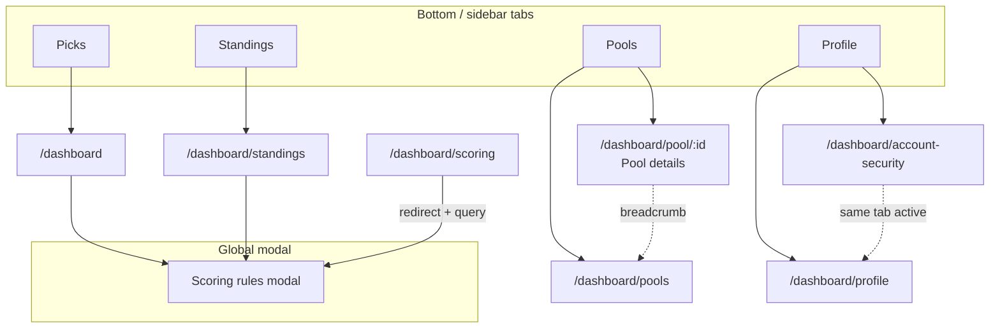

# Dashboard information architecture & vocabulary

Single reference for **support**, **product**, and **engineering** when adding routes or writing user-facing copy.

## Primary navigation (four-tab core)

| Tab (label) | Path | Purpose |
|-------------|------|---------|
| **Picks** | `/dashboard` | Lock/edit song picks for the **selected show** (global date picker). |
| **Pools** | `/dashboard/pools` | List pools; create/join. |
| **Standings** | `/dashboard/standings` | **Show standings** for the selected show (everyone or one pool). |
| **Profile** | `/dashboard/profile` | Handle, favorite song, sign-out; link to account security. |

**Admin** (fifth item, single admin user): `/dashboard/admin` — War Room.

### Pools parent / child (active state)

- **Pools** tab stays active on `/dashboard/pools` **and** `/dashboard/pool/:poolId` (**pool details**).
- **Profile** tab stays active on `/dashboard/profile` **and** `/dashboard/account-security`.

## Pool details desktop chrome (decision: Option C)

**Player-facing name:** **Pool details** (internal code may still say “Pool Hub”).

| Layer | What users see |
|--------|----------------|
| Mobile context bar | **Pool Details** |
| Desktop shell | Eyebrow **POOL DETAILS** (same typographic tier as in-page section labels, e.g. Game Status) |
| Under Back | Breadcrumb **Pools · {pool name}** (`Pools` links to list) |
| In-page hero | Pool **name** as `<h1>` + members line (unchanged) |

Rationale: **Entity-first** detail view without a second full-width display title duplicating the pool name; wayfinding ties back to **Pools**.

## Vocabulary (`src/shared/config/dashboardVocabulary.js`)

| Term | Meaning |
|------|---------|
| **Picks** | Tab + context + desktop H1 for `/dashboard` (`NAV_LABEL_PICKS`). |
| **Standings** | Short tab label (`NAV_LABEL_STANDINGS`); desktop H1 uses **Show standings** phrase. |
| **Show standings** | Ordered points for **one show date** only (Standings screen). |
| **Season totals** | Cumulative points / wins / shows in a pool (**pool details** screen). |
| **Pool details** | Screen for one pool: roster, invites, game status, archive links, season totals (`NAV_LABEL_POOL_DETAILS`). |

## Scoring rules (single primary surface)

- **Primary:** `ScoringRulesModal` via **`ScoringRulesModalProvider`** in the dashboard shell (`DashboardLayout`).
- **Entry:** “Scoring rules” actions call `useScoringRulesModal().openScoringRules`.
- **Deep link:** `/dashboard/scoring` **redirects** to `/dashboard?scoringRules=1`; query is consumed and stripped when the modal opens.
- **No** standalone scoring content page.

### Runtime contract: `useScoringRulesModal`

- **Only call** `useScoringRulesModal()` from components rendered **under** `ScoringRulesModalProvider` (today: route pages inside `DashboardLayout`).
- Calling it from the splash screen, Storybook stories, or tests **without** wrapping the provider will **throw** by design—wrap with `<ScoringRulesModalProvider>` in those environments, or open the modal via props on a test double.

## Continuous integration

GitHub Actions workflow **`.github/workflows/ci.yml`** runs:

1. `npm ci`
2. `npm run lint`
3. `npm run verify:dashboard-meta`

On **pull requests** (all branches) and on **push** to `main`, `master`, or `staging`. To cover other long-lived branches with push CI, add them under `on.push.branches` in that file.

**Locally:** same checks anytime with `npm run lint && npm run verify:dashboard-meta`.

## Route → meta map (engineering)

Implemented in `src/app/layout/model/dashboardPageMeta.js`. When you add a `/dashboard/*` route:

1. Update **`getDashboardPageMeta`** (`contextTitle`, `showDatePicker`, `layoutDesktopHeading`, `layoutDetailEyebrow` if needed).
2. Update **`DashboardLayout`** nav **`isActive`** if the route is a **child** of Picks, Pools, Profile, or Standings (mirror **Pools / pool details** and **Profile / account security**).
3. Add a row to **`scripts/verify-dashboard-meta.mjs`** and run **`npm run verify:dashboard-meta`** (enforced in **`.github/workflows/ci.yml`** next to `npm run lint`).

## IA diagram (high level)

## Related code

- `getDashboardPageMeta`, `normalizeDashboardPathname` — `src/app/layout/model/dashboardPageMeta.js`
- Nav items + active rules — `src/app/layout/DashboardLayout.jsx`
- Scoring modal provider — `src/features/scoring/ui/ScoringRulesModalProvider.jsx`
