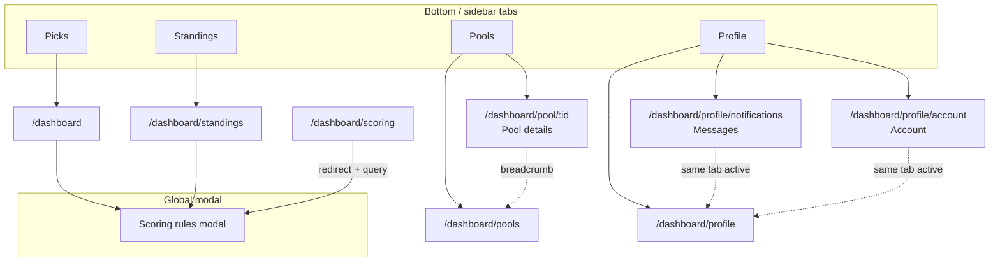

# Dashboard information architecture & vocabulary

Single reference for **support**, **product**, and **engineering** when adding routes or writing user-facing copy.

## Primary navigation (four-tab core)

| Tab (label) | Path | Purpose |
|-------------|------|---------|
| **Picks** | `/dashboard` | Lock/edit song picks for the **selected show** (global date picker). |
| **Pools** | `/dashboard/pools` | List pools; create/join. |
| **Standings** | `/dashboard/standings` | **Show standings** for the selected show (everyone or one pool). |
| **Profile** | `/dashboard/profile` | Profile **cluster**: identity, **Messages**, **Account** (sub-nav). |

**Admin** (fifth item, single admin user): `/dashboard/admin` — War Room.

### Standings child: Tour stats (#555)

| Route | Path | Notes |
|-------|------|-------|
| **Stats** (Standings peer tab) | `/dashboard/tour-stats` | Private explorer: unique songs, frequency, bustouts, self pick overlay. Discovered via Standings chrome **Show \| Tour \| Stats \| Pools** (not a 5th primary nav tab). Standings tab stays active. Shares the chrome **tour scope** picker with Tour view (`?tour=`). No global date picker. |

### Feature discovery “New” markers (#639)

Soft **New** labels (not coachmarks) may appear temporarily on:

- Standings chrome **Stats** pill → clears after visiting `/dashboard/tour-stats` (compact corner **dot**, not a “New” text label — keeps the Stats word readable in the four-tab chrome)
- Official setlist card on Standings → clears when the card is toggled open/closed
- Profile **Avatar** / **Badges** headings → clears after picking an avatar

Markers auto-expire by catalog `until` date and persist dismissals in `localStorage` per signed-in uid. Support can tell users: clear site data for the origin if a marker is stuck; otherwise ignore — they vanish by end of the window.

### Profile cluster (#418)

| Sub-nav | Path | Responsibility |
|---------|------|----------------|
| **Profile** | `/dashboard/profile` | Handle, favorite song, public preview, join date |
| **Messages** | `/dashboard/profile/notifications` | `commsInbox` + push/category/email prefs |
| **Account** | `/dashboard/profile/account` | Sign-in method, logout, delete, Privacy/Terms |

Legacy redirects (preserve bookmarks + email deep links):

- `/dashboard/notifications` → `/dashboard/profile/notifications` (query string preserved, e.g. `?openPush=1`)
- `/dashboard/account-security` → `/dashboard/profile/account`

Avatar in the mobile brand bar links to **Account**. Bell links to **Messages**.

### Pools parent / child (active state)

- **Pools** tab stays active on `/dashboard/pools` **and** `/dashboard/pool/:poolId` (**pool details**).
- **Profile** tab stays active on the entire Profile cluster (including legacy redirect paths).

## Pool details desktop chrome (decision: Option C)

**Player-facing name:** **Pool details** (internal code may still say “Pool Hub”).

| Layer | What users see |
|--------|----------------|
| Mobile context bar | **Pool Details** |
| Desktop shell | Eyebrow **POOL DETAILS** (same typographic tier as in-page section labels, e.g. Game Status) |
| Under Back | Breadcrumb **Pools · {pool name}** (`Pools` links to list) |
| In-page hero | Pool **name** as `<h1>` + members line (unchanged) |

Rationale: **Entity-first** detail view without a second full-width display title duplicating the pool name; wayfinding ties back to **Pools**.

## Vocabulary (`src/shared/config/dashboardVocabulary.js`)

| Term | Meaning |
|------|---------|
| **Picks** | Tab + context + desktop H1 for `/dashboard` (`NAV_LABEL_PICKS`). |
| **Pools** | Tab + context + desktop H1 for `/dashboard/pools` (`NAV_LABEL_POOLS`) — same word in nav and shell. |
| **Profile** | Tab + context for `/dashboard/profile` (`NAV_LABEL_PROFILE`); desktop in-page subheading matches. |
| **Messages** | Profile-cluster inbox + prefs (`NAV_LABEL_MESSAGES`); path `/dashboard/profile/notifications`. |
| **Account** | Profile-cluster account surface (`NAV_LABEL_ACCOUNT`); path `/dashboard/profile/account`. |
| **Admin** | Tab label for `/dashboard/admin` (`NAV_LABEL_ADMIN`); context + desktop H1 stay **War Room** (meta string in `dashboardPageMeta.js`). |
| **Standings** | Tab, context bar for `/dashboard/standings` and `/dashboard/tour-stats` (`NAV_LABEL_STANDINGS`). Desktop **Standings** title + Show/Tour/Stats/Pools pills live in sticky in-page chrome (not the layout H2) so banners and the leaderboard scroll underneath. View is URL-synced via `?view=show\|tour\|pools` on standings; **Stats** navigates to `/dashboard/tour-stats`. Pools view takes an optional `?pool=<id>` sub-selector. `?view=tour` and `/dashboard/tour-stats` hide the global date picker and show the shared tour scope picker (`?tour=`). |
| **Show standings** | Ordered points for **one show date** only (Standings screen); use this phrase in glossary, help, and cross-links where the “one night” nuance matters. |
| **All-time standings** | Cumulative points / wins / shows across **every** finalized show (all tours). Canonical name on pool details (`POOL_ALL_TIME_STANDINGS_HEADING`) and optional global companion on Standings. Replaces legacy **Season totals**. See #148. |
| **Tour standings** | Cumulative points / wins / shows scoped to the **current tour** via `show_calendar.showDatesByTour` (`TOUR_STANDINGS_HEADING`). Global on Standings (#219), pool-scoped on pool details (#148). |
| **Season totals** | Legacy alias of **All-time standings** on pool details; retained as a `@deprecated` re-export while the pool-side migration (#148) lands. Avoid in new copy. |
| **Tonight's winner / winners** | Standings "Overall winner of the night" banner (#218). Singular on a clean win, plural on ties — `tonightsWinnerHeading(winnerCount)` picks automatically. On **Pools**, computed from pool-filtered picks (same audience as the leaderboard). |
| **Last show's winner / winners** | Standings callout for the **prior tour night** while the selected show is **NEXT** (picks still open) (#218, #305). Hidden once picks lock (**LIVE**). **Show tab:** global prior-night picks; **Pools tab:** pool-filtered prior night (same rules as tonight for that audience). Heading uses `lastShowWinnerHeading(winnerCount, poolName?)` — on Pools, suffix **`· {pool name}`** when known. |
| **View results** (Standings) | **Show tab only:** `DashboardRowPill` on the last-show winner banner jumps to `/dashboard/standings?showDate=<prior night>`; `DashboardLayout` syncs the global date picker (layout `setSelectedDate` + URL so repeat clicks work). **Pools:** banner may still show; **no** View results link (product lock #305). Implementation: `StandingsWinnerOfTheNightBanner`, `useStandingsScreen`, `StandingsPage` / `onSelectShowDate`. |
| **Wins** | For any scope (one show, a tour, all-time), the count of shows where a player ties/beats the global high score across every graded non-empty pick (`max === 0 → skip`). Same rule on Profile, Standings, Tour standings, and pool surfaces; implemented once in `src/shared/utils/showAggregation.js::reduceShowWinners`. |
| **Pool details** | Screen for one pool: roster, invites, game status, archive links, All-time and Tour standings (`NAV_LABEL_POOL_DETAILS`). |

### User-visible string ownership (support / engineering)

| Users see | Route / surface | Source of truth |
|-----------|-----------------|-----------------|
| Picks | `/dashboard` | `NAV_LABEL_PICKS` |
| Pools | `/dashboard/pools` | `NAV_LABEL_POOLS` |
| Pool Details (context) | `/dashboard/pool/:id` | `NAV_LABEL_POOL_DETAILS` |
| Pool details (desktop eyebrow) | Pool hub | `POOL_DETAILS_LAYOUT_EYEBROW` |
| Standings | `/dashboard/standings` | `NAV_LABEL_STANDINGS` |
| Profile | `/dashboard/profile` | `NAV_LABEL_PROFILE` |
| Messages | `/dashboard/profile/notifications` | `NAV_LABEL_MESSAGES` |
| Account | `/dashboard/profile/account` | `NAV_LABEL_ACCOUNT` |
| War Room | `/dashboard/admin` | `getDashboardPageMeta` (admin branch) |
| Admin (tab only) | `/dashboard/admin` | `NAV_LABEL_ADMIN` in `DashboardLayout.jsx` |

## Scoring rules (single primary surface)

- **Primary:** `ScoringRulesModal` via **`ScoringRulesModalProvider`** in the dashboard shell (`DashboardLayout`).
- **Entry:** “Scoring rules” actions call `useScoringRulesModal().openScoringRules`.
- **Deep link:** `/dashboard/scoring` **redirects** to `/dashboard?scoringRules=1`; query is consumed and stripped when the modal opens.
- **No** standalone scoring content page.

### Runtime contract: `useScoringRulesModal`

- **Only call** `useScoringRulesModal()` from components rendered **under** `ScoringRulesModalProvider` (today: route pages inside `DashboardLayout`).
- Calling it from the splash screen, Storybook stories, or tests **without** wrapping the provider will **throw** by design—wrap with `<ScoringRulesModalProvider>` in those environments, or open the modal via props on a test double.

## Continuous integration

GitHub Actions workflow **`.github/workflows/ci.yml`** runs:

1. `npm ci`
2. `npm run lint`
3. `npm run verify:dashboard-meta`

On **pull requests** (all branches) and on **push** to `main`, `master`, or `staging`. To cover other long-lived branches with push CI, add them under `on.push.branches` in that file.

**Locally:** same checks anytime with `npm run lint && npm run verify:dashboard-meta`.

## Route → meta map (engineering)

Implemented in `src/app/layout/model/dashboardPageMeta.js`. When you add a `/dashboard/*` route:

1. Update **`getDashboardPageMeta`** (`contextTitle`, `showDatePicker`, `layoutDesktopHeading`, `layoutDetailEyebrow` if needed).
2. Update **`DashboardLayout`** nav **`isActive`** if the route is a **child** of Picks, Pools, Profile, or Standings (mirror **Pools / pool details** and **Profile / account security**).
3. Add a row to **`scripts/verify-dashboard-meta.mjs`** and run **`npm run verify:dashboard-meta`** (enforced in **`.github/workflows/ci.yml`** next to `npm run lint`).

## IA diagram (high level)

## Related code

- `getDashboardPageMeta`, `normalizeDashboardPathname` — `src/app/layout/model/dashboardPageMeta.js`
- `PROFILE_CLUSTER_PATHS`, `isProfileClusterPath` — `src/shared/config/dashboardRoutes.js`
- Profile cluster layout — `src/app/layout/ui/ProfileClusterLayout.jsx`
- Nav items + active rules — `src/app/layout/DashboardLayout.jsx`
- Scoring modal provider — `src/features/scoring/ui/ScoringRulesModalProvider.jsx`

## Related documentation

User journeys and post-auth routing (new vs returning users, invite flows, remembered tab): [USER_ROUTING_AND_JOURNEYS.md](./USER_ROUTING_AND_JOURNEYS.md).
