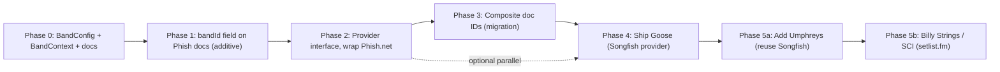
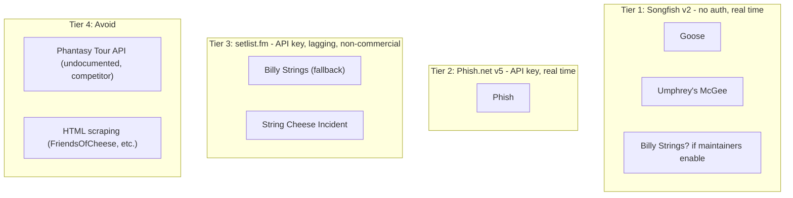

# Multi-Band Collections - Architecture Analysis & Rollout Strategy

> Status: **Draft / not yet scheduled**. Strategy doc capturing the analysis behind broadening Set Picks beyond Phish into per-band "collections" (starting with Goose via [ElGoose.net](https://elgoose.net/api/docs)). This is the architectural source of truth; operational runbooks (e.g. `MULTI_BAND_MIGRATION.md`) will be added per phase as work is scheduled.

## 1. Current single-band coupling map

What's **already band-agnostic** (small surface to defend):

- Dashboard nav vocabulary (`Picks`, `Pools`, `Standings`, `Profile`) in [src/shared/config/dashboardVocabulary.js](../src/shared/config/dashboardVocabulary.js) and IA in [docs/DASHBOARD_IA.md](./DASHBOARD_IA.md)
- Route structure (`/dashboard/*`) and `getDashboardPageMeta`
- SEO copy in [src/shared/config/seo.js](../src/shared/config/seo.js) - already says "live music"
- `index.html` title `Setlist Pick 'Em`
- Most Firestore collection **names** are neutral: `pools`, `users`, `picks`, `official_setlists`, `live_setlist_automation`, `rollup_audit`, `show_calendar`

What is **hard-coupled to Phish** (the work):

- **Server pipelines** are Phish.net-only: `functions/phishnetShowCalendar.js`, `phishnetSongCatalog.js`, `phishnetLiveSetlistAutomation.js`, callable `getPhishnetSetlist`, secret `PHISHNET_API_KEY`. Show normalization filters `Number(row.artistid) !== 1` (Phish-only).
- **Document IDs assume one band per date**: `picks/{showDate}_{uid}`, `official_setlists/{showDate}`, `live_setlist_automation/{showDate}`, `rollup_audit/{showDate}`. Two bands playing 2026-08-15 collide today.
- **Single calendar / catalog blobs**: `show_calendar/snapshot` (one document), Storage `song-catalog.json` (one object).
- **Game shape baked in** at [src/shared/data/gameConfig.js](../src/shared/data/gameConfig.js) - six slots `s1o/s1c/s2o/s2c/enc/wild` modeled on Phish's 2-set + encore + wildcard.
- **Aggregates on `users/{uid}`** are universal (`totalPoints`, `wins`, `showsPlayed`, `seasonStats[tourKey]`) - not band-namespaced.
- **Phish-named code/scripts**: ~30 files under `functions/` and `scripts/` use `phishnet*` names. Public-facing copy is small (~8 files in `src/features/landing/ui` + admin labels + `phish_pool_pending_invite` storage key).
- **Bundled Phish song fallback**: 1,091-line [src/shared/data/phishSongs.js](../src/shared/data/phishSongs.js) and `functions/phishSongs.js`.

## 2. Provider feasibility check

The biggest finding here is that **three of the four target bands ride on the same underlying engine** ([Songfish](https://dev.songfishapp.com/api/docs/), a SaaS setlist platform). One provider implementation against the Songfish v2 API shape covers Goose **and** Umphrey's McGee **and** the back-end of BillyBase, regardless of how many bands we add later from the same family.

### Provider tiers

- **Tier 1 - Songfish v2 (no auth, JSON, identical shape per host)**: covers **Goose** ([elgoose.net/api/v2](https://elgoose.net/api/docs)) and **Umphrey's McGee** ([allthings.umphreys.com/api/v2](https://allthings.umphreys.com/api/docs) - branded "UMbase", explicitly forked from Songfish per [umbase.umphreys.com](https://umbase.umphreys.com/)). Identical endpoints to ElGoose: `setlists/showdate/{date}.json`, `setlists/showyear/{year}.json`, `songs.json`, `shows.json`, `latest.json`, `metadata/song_slug/{slug}.json`. Same `{ error, error_message, data }` envelope, same `order_by` / `direction` / `limit` query params, same `artist=X` filter. **One provider implementation, multiple bands.** No API keys, no secret management.
- **Tier 2 - Phish.net v5 (API key, JSON)**: existing integration. Same general shape as Songfish (almost certainly a shared lineage) but with a required `apikey` query param, `gap` field for bustouts, and "exclude_from_stats" semantics. Already implemented in this repo.
- **Tier 3 - setlist.fm v1 (API key, MBID-keyed, paginated)**: covers everything (including **Billy Strings**, **String Cheese Incident**, plus any artist with MBID coverage), but **non-commercial-only** per their ToS - if Set Picks ever monetizes, this becomes a legal/contract issue. Free-tier rate limit is undocumented (case-by-case email upgrades). Different data shape (`set[].song[]`, `eventDate` in `dd-MM-yyyy`, no native bustout/gap). Wiki-edit model means setlists may lag a real-time prediction game by hours.
- **Tier 4 - Undocumented / scraping (last resort)**: Phantasy Tour has an undocumented JSON API (`https://www.phantasytour.com/api/bands/{bandId}/setlists/paged?...`, SCI is `bandId=12`) that some community gists have reverse-engineered. Phantasy Tour also runs its own setlist prediction games, so consuming their API to power a competing product is awkward and brittle. Other fan sites (FriendsOfCheese.com, BillyBase frontend) have no public API and would require HTML scraping.

### Per-target-band map

- **Phish** - Tier 2, already shipped.
- **Goose** ([ElGoose.net](https://elgoose.net/api/docs)) - Tier 1. No key needed. Fast on-ramp; this is the right second band.
- **Umphrey's McGee** ([allthings.umphreys.com/api/docs](https://allthings.umphreys.com/api/docs)) - Tier 1. **Once the Songfish provider exists for Goose, adding UM is essentially a band-config entry plus a base-URL swap.** Lowest marginal cost of any new band on the roadmap.
- **Billy Strings** - **No first-party API.** [BillyBase.net](https://billybase.net/) is "powered by Songfish" on the back end but does **not** expose `/api/v2/` publicly (verified via probe; returns 404). Either (a) ask the BillyBase / Songfish maintainers to enable the public API endpoint as they did for ElGoose / Umphrey's, or (b) fall back to setlist.fm (Tier 3). Option (a) is the cleanest if the maintainers say yes.
- **String Cheese Incident** - **No first-party API.** [FriendsOfCheese.com](https://www.friendsofcheese.com/) is the canonical archive but exposes only HTML pages. Real options are (a) setlist.fm Tier 3 (commercial-use caveat), (b) Phantasy Tour Tier 4 (undocumented + competitive overlap), or (c) reach out to FriendsOfCheese maintainers about a data feed.

### Game shape compatibility

- All five bands play **2 sets + encore** as the dominant format - the current 6-slot `s1o/s1c/s2o/s2c/enc/wild` config in [src/shared/data/gameConfig.js](../src/shared/data/gameConfig.js) maps cleanly.
- Edge cases (one-set festival shows for SCI / Billy Strings, "sit-down acoustic" sets for Billy Strings) are handled today by leaving slots blank or unscored. No slot-config refactor needed before launching the next band.

## 3. Key architectural forks (with recommendations)

### Fork A: Multi-tenancy in Firestore

- **A1. Composite doc IDs + `bandId` field** (recommended): `picks/{bandId}_{showDate}_{uid}`, `official_setlists/{bandId}_{showDate}`, `show_calendar/{bandId}_snapshot`. Minimal rules churn, queries add `where('bandId','==', X)`. Migration is a one-time rename script for existing Phish docs (rename `2026-04-16_uid` -> `phish_2026-04-16_uid`).
- **A2. Per-band root collections**: `bands/{bandId}/picks/{showDate}_{uid}`. Cleaner mental model but every Cloud Function trigger path, every rule, and every query in the client must change. Bigger blast radius.
- **A3. Per-band Firebase project**: total isolation; over-engineered, breaks cross-band UX.

**Recommend A1** - smallest diff, query patterns already use `where(showDate==X)`, doc-id namespacing solves the date collision.

### Fork B: Provider abstraction shape

The Songfish discovery (Section 2) reshapes this fork. The right unit of abstraction is **one provider per API family**, not one provider per band - Goose and Umphrey's McGee both use the Songfish Tier 1 shape, so a single `songfish` provider serves both.

- **B1. Provider-per-API-family** (recommended): `functions/providers/{providerId}/index.js` where `providerId` is `phishnet | songfish | setlistfm | ...`. Each band's `BandConfig` declares `providerId` plus per-band args (`baseUrl`, `artistId`, `songCatalogStorageKey`, etc.). Each provider exports a fixed contract (`fetchShowsForYear`, `fetchSetlistForDate`, `fetchSongs`, `normalizeShows`, `normalizeSetlistRows`, `responseOk`). One scheduler iterates registered bands and dispatches to the appropriate provider.
- **B2. Provider-per-band**: simpler one-to-one mapping, but you'd write the same Songfish HTTP/normalization code three times for Goose, UM, and (if the maintainers enable it) BillyBase. Clear waste.
- **B3. Single generic `SetlistProvider` with config args**: thinnest code, but Phish.net's `gap`-based bustouts vs Songfish's `metadata` endpoint vs setlist.fm's MBID/wiki model genuinely differ - forcing them through one normalizer pollutes the contract.

**Recommend B1**. The marginal cost of adding Umphrey's McGee after Goose drops to roughly "register a band, point at `allthings.umphreys.com`, pass `artist=1`" - the entire provider stack is reused. setlist.fm becomes its own provider only if/when we need a Tier 3 band (Billy Strings, SCI).

### Fork C: Pool & user aggregate scope

- **C1. Pools and aggregates are band-scoped** (recommended): pools have `bandId`; `users/{uid}.statsByBand[bandId].{totalPoints, wins, showsPlayed, seasonStats}`. Each band has its own leaderboard universe.
- **C2. Pools and aggregates are cross-band**: a single global score sums Phish + Goose nights. Conceptually weird (different songbooks, different difficulty), and breaks all existing "tour standings" framing.

**Recommend C1**. Keep the legacy fields (`totalPoints`, `wins`) on `users` as a deprecated alias initially; migrate readers to `statsByBand.phish.*` over time.

### Fork D: Game shape per band

- **D1. Universal 6-slot** (recommended for now): keep `s1o/s1c/s2o/s2c/enc/wild` as the default; allow per-band `slotConfig` override later if a band's format differs (e.g. one-set festival sets, no encore). No upfront work.
- **D2. Per-band slot config from day 1**: introduces a `BandConfig.slots` array consumed by `PicksFieldsForm`, `gradePickAgainstSetlist`, and admin builder. Significant client refactor; defer.

**Recommend D1** until a band requires a different shape.

### Fork E: User-facing collection model

- **E1. Active band toggle** (recommended): user follows N bands; dashboard has a band switcher in the top bar; pools, picks, standings filter by the active band. One band's UX at a time, but the user can switch instantly. Mirrors how fantasy apps handle multi-league.
- **E2. Concurrent multi-band dashboard**: every screen merges/sections by band. Higher information density, harder UX, breaks the existing single-date global picker model.
- **E3. Sub-branded sites**: `phish.setpicks.com`, `goose.setpicks.com`. Cleanest brand story, worst code reuse + auth/session story.

**Recommend E1**. The existing `ShowCalendarProvider` becomes band-aware; band id lives in URL or context.

### Fork F: Rollout strategy

- **F1. Big-bang refactor first**: introduce all abstractions, migrate Phish, then add Goose. Cleanest end state, longest dark period.
- **F2. Strangler / "Phish as the first collection"** (recommended): treat current code as the `phish` provider; add `bandId="phish"` defaults; introduce abstractions provider-by-provider as Goose lands. Ship Goose without breaking Phish.
- **F3. Parallel stack**: build Goose pipelines side-by-side with Phish, never unify. Fast for Goose, becomes 2x maintenance forever.

**Recommend F2**.

## 4. Recommended phased rollout

### Phase 0 - Foundation (no user-visible change)

- Define `BandConfig` shape in `src/shared/config/bands.js`: `{ id, displayName, providerId, providerArgs: { baseUrl, artistId, ... }, color, songCatalogStorageKey, slotConfig, footerAttribution }`. Seed with `phish` only; reserve config slots for `goose`, `umphreys`.
- Define provider contract (JSDoc) for server providers in `functions/providers/_contract.md`. Document the two near-term provider families: `phishnet` and `songfish`.
- Add `BandContext` (React) in `src/app/providers/BandContext.jsx`; default to `phish`. No switcher UI yet.
- Document the migration plan in `docs/MULTI_BAND_MIGRATION.md`.

### Phase 1 - Namespace existing Phish data with `bandId`

- Add `bandId: "phish"` field on writes for: `picks`, `official_setlists`, `live_setlist_automation`, `rollup_audit`, `pools`. Rules updated to require it.
- One-time migration script in `scripts/migrate-phish-to-bandid.mjs` to backfill the field on existing docs (don't rename doc IDs yet - separate phase to limit risk).
- Update queries in [src/features/scoring/api/standingsApi.js](../src/features/scoring/api/standingsApi.js), [src/features/picks/api/picksApi.js](../src/features/picks/api/picksApi.js), [src/features/pools/api/poolStandings.js](../src/features/pools/api/poolStandings.js) to filter `where('bandId','==', activeBand)`.
- Storage: rename `song-catalog.json` -> `song-catalog/phish.json` with a redirect alias.

### Phase 2 - Wrap Phish.net behind `BandPack`

- Move `functions/phishnetShowCalendar.js`, `phishnetSongCatalog.js`, `phishnetLiveSetlistAutomation.js` under `functions/providers/phish/`. No behavior change.
- Generic scheduler entry points in `functions/index.js` iterate `[phishProvider]` and dispatch.
- Refactor [src/features/admin-setlist-config/api/phishApiClient.js](../src/features/admin-setlist-config/api/phishApiClient.js) to a `getProviderClient(bandId)` factory.

### Phase 3 - Migrate doc IDs to composite (`{bandId}_{showDate}[_{uid}]`)

- Riskiest single migration. Plan a maintenance window. New writes use new IDs; readers tolerate both during cutover; backfill renames; flip readers to new-only; delete old.
- This is the step that unlocks two bands sharing a date. If you don't do this, Goose can ship with a parallel Phish-only setup but two bands cannot play the same night.
- Update Cloud Function triggers (`onDocumentWritten('official_setlists/{docId}', ...)`) to parse `{bandId}_{showDate}` from `docId`.

### Phase 4 - Ship Goose (first second-band)

- Implement `functions/providers/songfish/index.js` against the Songfish v2 shape (`elgoose.net/api/v2/...`). No secret needed. **This provider will be reused for Umphrey's McGee in Phase 5a with no new code.**
- Add `goose` to `BandConfig` registry: `{ providerId: 'songfish', providerArgs: { baseUrl: 'https://elgoose.net/api/v2', artistId: 1 } }`. Provision `show_calendar/goose_snapshot` and `song-catalog/goose.json`.
- Add band switcher to `DashboardLayout` top bar; persist active band in user preferences (`users/{uid}.activeBandId`) and URL (`?band=goose`).
- Per-band pools: pool create form picks a band; existing pools default to `phish`.
- Migrate `users/{uid}` aggregates: introduce `statsByBand.{bandId}` while keeping legacy fields as a deprecated alias.
- Update splash/about/footer copy to be band-list aware (or generic + per-band sub-pages); add ElGoose.net attribution alongside Phish.Net.

### Phase 5a - Add Umphrey's McGee (cheapest follow-on)

- **Estimated effort: small.** No new provider code. Add `umphreys` to `BandConfig` with `{ providerId: 'songfish', providerArgs: { baseUrl: 'https://allthings.umphreys.com/api/v2', artistId: 1 } }` and an attribution line for All Things Umphreys.
- Provision storage / show calendar slots; verify the Songfish provider's normalizers handle UM's tour-name strings, set numbering quirks, and cover-vs-original metadata.
- This phase is the strongest argument for landing the Songfish provider correctly in Phase 4 - the second band on the platform should cost days, not weeks.

### Phase 5b - Stretch (defer until two bands are healthy)

- **Billy Strings**: outreach to BillyBase / Songfish maintainers about a public `/api/v2/` endpoint (cleanest path). If unavailable, build a `setlistfm` provider as Tier 3, accepting the non-commercial-only ToS implications and rate-limit volatility.
- **String Cheese Incident**: same `setlistfm` provider, or outreach to FriendsOfCheese maintainers. Avoid Phantasy Tour API (competitive overlap, undocumented).
- Cross-band "trophy room" or unified profile view if there's user demand.
- Per-band slot configs (Fork D2) only if a band genuinely needs a different shape.

## 5. Considerations, risks, trade-offs

- **Migration risk is the #1 cost**, not new code. Phase 3 (doc-id rename) is the riskiest single step; everything else is additive. Budget for a careful audit + dry-run + rollback plan.
- **Cloud Function trigger paths embed doc IDs**, so renaming requires updating `gradePicksOnSetlistWrite`, the live poller, and rollup writers in lockstep. Detail in [functions/index.js](../functions/index.js).
- **Rules complexity grows**: every collection rule needs a `bandId` validator and `request.resource.data.bandId == resource.data.bandId` (immutability). Test thoroughly via `npm run rules`.
- **Storage cost / ops**: per-band `song-catalog/{bandId}.json`, per-band `live_setlist_automation` polling state. Schedulers must dispatch per active band, not per global cron, or polling cost grows linearly.
- **ElGoose attribution**: footer/UI must credit ElGoose.net the same way Phish.Net is credited today (see [src/features/landing/ui/SplashPageShell.jsx](../src/features/landing/ui/SplashPageShell.jsx)). Confirm any rate limits / acceptable use directly with ElGoose.
- **Same-night collisions**: until Phase 3 lands, two bands cannot share a show date. If Goose and Phish overlap before then, Goose's `official_setlists/2026-08-15` would clobber Phish's. Phase 3 is non-optional once a second band ships.
- **Branding direction is a product decision** (Fork E): single app + switcher vs. sub-brands has marketing implications outside this engineering plan.
- **The `phish_pool_pending_invite` localStorage key** ([src/shared/config/poolInvite.js](../src/shared/config/poolInvite.js)) should be renamed neutrally before invites need to carry a `bandId`.
- **Game shape uniformity** is a happy accident: 6-slot 2-set+encore+wild fits Goose and Billy Strings. Don't generalize until forced.
- **Admin tooling doubles**: War Room currently assumes one calendar, one catalog, one polling job. Either parameterize each surface by band or build a band picker into War Room.
- **Tour standings logic** in [src/features/scoring/model/resolveCurrentTour.js](../src/features/scoring/model/resolveCurrentTour.js) reads `show_calendar.showDatesByTour`; needs to resolve "current tour" per band.
- **setlist.fm commercial-use restriction**: per their [API ToS](https://api.setlist.fm/), the API is "only free for non-commercial projects." Any band that depends on setlist.fm (Billy Strings, SCI today) creates a constraint on the product's monetization model. Confirm the project's commercial posture before committing to a setlist.fm-dependent band.
- **Phantasy Tour competitive overlap**: Phantasy Tour runs its own setlist prediction games for SCI, UM, and others. Consuming their (undocumented) API to power a competing product is technically possible but carries real "your access could disappear tomorrow" risk and is not recommended.
- **Songfish maintainer relationship**: Goose, Umphrey's McGee, and BillyBase are all on Songfish but only the first two expose `/api/v2/` publicly. Any band that lives on Songfish *without* a public API (Billy Strings today) is unblocked by a single conversation with the maintainers - worth attempting before falling back to setlist.fm.
- **Real-time freshness varies sharply by provider**: Phish.net and Songfish-family sites publish setlists in near real time (often during the show). setlist.fm is wiki-edited and frequently lags by hours - probably too slow for the live grading flow that drives `gradePicksOnSetlistWrite`. A setlist.fm-backed band may need to fall back to admin-entered live setlists with the API as the canonical source after the fact.

## 6. Recommended next concrete deliverable

Open a tracking issue + scoping doc covering Phases 0-1 only (foundation + bandId namespacing without doc-id rename). Land that before designing Phase 3, because the field-only migration is reversible and gives real production signal on rule + query changes.

## 7. Trade-off summary at a glance

- **Smallest viable change**: Phases 0-2 + add Goose as a parallel stack without Phase 3. Risk: Goose can never share a show date with Phish.
- **Most correct end state**: Phases 0-4 + 5a (Phish, Goose, Umphrey's). Risk: Phase 3 is a real migration. Reward: three healthy bands on one platform with no setlist.fm dependency or commercial-use risk.
- **Fastest to "Goose game in production"**: Skip Phase 3, ship Goose with a separate set of collections (`goose_picks`, `goose_official_setlists`, ...). Worst long-term maintenance; not recommended.
- **Where the platform stops being free**: Adding Billy Strings or SCI (Phase 5b) introduces setlist.fm and its non-commercial-only ToS. Consider this a product/business decision, not just an engineering one.

## 8. Phase tracking

| Phase | Status | Issue / PR |
|-------|--------|-----------|
| Phase 0 - Foundation | Not started | - |
| Phase 1 - bandId field | Not started | - |
| Phase 2 - Provider wrap | Not started | - |
| Phase 3 - Composite IDs | Not started | - |
| Phase 4 - Goose (Songfish provider) | Not started | - |
| Phase 5a - Umphrey's McGee (reuse Songfish) | Not started | - |
| Phase 5b - Billy Strings / SCI (setlist.fm) | Deferred / pending product decision | - |

## 9. Provider feasibility matrix

Single source of truth for "can we add band X, and how hard is it?"

| Band | Primary source | Provider tier | Auth | Real-time freshness | Commercial use OK? | Marginal cost after Phase 4 |
|------|----------------|--------------|------|---------------------|-------------------|----------------------------|
| **Phish** | [api.phish.net/v5](https://api.phish.net/) | Tier 2 (Phish.net) | API key (`PHISHNET_API_KEY`) | Near real time | Yes | Already shipped |
| **Goose** | [elgoose.net/api/v2](https://elgoose.net/api/docs) | Tier 1 (Songfish) | None | Near real time | Yes (attribution required) | New provider implementation; baseline cost for Phase 4 |
| **Umphrey's McGee** | [allthings.umphreys.com/api/v2](https://allthings.umphreys.com/api/docs) | Tier 1 (Songfish, branded UMbase) | None | Near real time | Yes (attribution required) | **Trivial - reuses Goose's provider, only needs `BandConfig` entry + base URL swap** |
| **Billy Strings** | None public. [BillyBase.net](https://billybase.net/) is on Songfish but `/api/v2/` is **not exposed** (verified 404). | Tier 1 *if maintainers enable it*, else Tier 3 (setlist.fm) | None (Tier 1) or API key (Tier 3) | Tier 1: near real time. Tier 3: hours of lag (wiki edits) | Tier 3 is **non-commercial only** | Outreach + provider config (best case) or full setlist.fm provider (worst case) |
| **String Cheese Incident** | None public. [FriendsOfCheese.com](https://www.friendsofcheese.com/) (HTML only). [Phantasy Tour](https://www.phantasytour.com/bands/sci/stats) (undocumented + competitor). | Tier 3 (setlist.fm) realistically | API key | Hours of lag | **Non-commercial only** | Same as Billy Strings worst case |

**Recommendation**: prioritize Goose (Phase 4) and Umphrey's McGee (Phase 5a) - both Tier 1, both near-real-time, both unrestricted commercially. Defer Billy Strings and SCI until either (a) the BillyBase / Songfish maintainers open up their API, or (b) the project has resolved its commercial posture re: setlist.fm.

