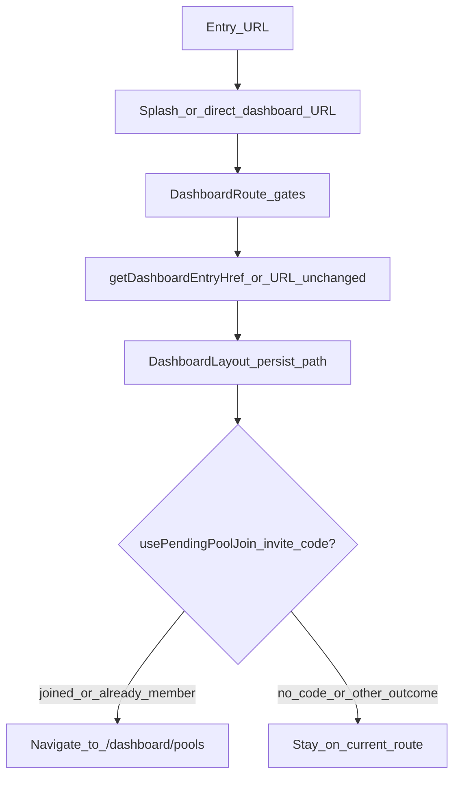

# User routing and journeys

Canonical map of **entry URLs**, **auth gates**, and **where users land after sign-in** (including **remember-last-tab** and **pool invite** overrides). For dashboard tab names and copy, see [DASHBOARD_IA.md](./DASHBOARD_IA.md).

## Top-level routes

Defined in `src/app/App.jsx`.

| Path | Access | Purpose |
|------|--------|---------|
| `/` | Public (splash); redirects if session exists | Marketing / SEO landing; auth modals |
| `/join` | Public | Missing invite code → redirect home (`PoolInviteMissingCodePage`) |
| `/join/:code` | Public | Stores invite code, redirects to `/`; auth funnel for join |
| `/setup` | Signed-in only | Profile setup until Firestore user doc exists |
| `/dashboard/*` | Signed-in + profile | App shell (`DashboardLayout`) |
| `/user/:userId` | Public | Public player profile (no dashboard restore) |
| `/password-reset-complete` | Public | Firebase password reset continuation URL |

## Auth gates

### Dashboard shell

`src/app/routes/DashboardRoute.jsx`:

- **Loading** → auth loading screen
- **No Firebase user** → `Navigate` to `/`
- **No user profile doc** (first-time setup) → `Navigate` to `/setup`
- **Else** → `DashboardLayout`

### Setup

`src/app/routes/SetupRoute.jsx`:

- **No user** → `/`
- **Profile already exists** → `Navigate` to `getDashboardEntryHref(...)` (same post-auth target as home for signed-in users)
- **Else** → `ProfileSetupPage`

## Post-auth landing: `getDashboardEntryHref`

Implemented in `src/shared/lib/dashboardLastPath.js` and used from:

- `src/app/routes/HomeRoute.jsx` (signed-in visitor on `/`)
- `src/app/routes/SetupRoute.jsx` (profile already complete)
- `src/features/auth/model/useProfileSetup.js` (after first profile save, full page load)

### localStorage

- **Key:** `setpicks_dash_last_loc_v1`
- **Value:** JSON `{ "pathname": string, "search": string }` (search includes `?` when non-empty)

### When it updates

`src/app/layout/DashboardLayout.jsx` runs `persistDashboardPath(pathname, search, { isAdminUser })` on every `location` change while the shell is mounted. Only **eligible** paths are written (see below).

### Excluded from persist and restore

- `/dashboard/profile`
- `/dashboard/account-security`

Rationale: users often open **Profile** only to sign out; remembering those routes would send them back to Profile on every login. Visiting Profile does **not** overwrite the last remembered game tab.

### Admin

- `/dashboard/admin` is remembered and restored **only** for the admin user (`isAdminUser` in callers; same rule as nav). Non-admins do not persist admin URL; stored admin URL is ignored on restore for non-admins.

### Fallback

If nothing is stored, stored JSON is invalid, or the path is ineligible → **`/dashboard`** (Picks tab).

### Eligible remembered paths (summary)

| Path pattern | Notes |
|--------------|--------|
| `/dashboard` | Picks (optional safe query, e.g. scoring modal deep link) |
| `/dashboard/pools` | Pool list |
| `/dashboard/standings` | Standings; query string must pass safe-character rules |
| `/dashboard/scoring` | Redirects in-app to Picks + modal; still a valid stored path |
| `/dashboard/pool/:poolId` | Pool details (`poolId` alphanumerics + `_-`) |
| `/dashboard/admin` | Admin only |
| `/dashboard/profile` | **Not** eligible |
| `/dashboard/account-security` | **Not** eligible |

## Scenarios

### A. First-time user, no invite

1. Open `/` → `HomeRoute` → `LandingPage` / `SplashPage`.
2. Sign up or sign in → Firebase session.
3. `HomeRoute` → `<Navigate to={getDashboardEntryHref} />` → typically **`/dashboard`** (empty storage).
4. `DashboardRoute` → no profile → **`/setup`** → profile form.
5. After successful save → `window.location.href = getDashboardEntryHref(...)` → usually **`/dashboard`**.
6. `DashboardLayout` → default nested route **`/`** → **Picks**.

### B. First-time user with invite (`/join/:code`)

1. `usePoolInviteInterceptor` (`src/features/pool-invite/model/usePoolInviteInterceptor.js`): valid code → saved under pool-invite storage key → **`navigate('/', { replace: true })`**.
2. `SplashPage`: if invite code present in storage → toast + open sign-in modal (`src/pages/landing/SplashPage.jsx`).
3. After auth → `HomeRoute` → `getDashboardEntryHref` → usually **`/dashboard`** (new device/browser).
4. `DashboardRoute` → **`/setup`** if no profile; after setup → **`/dashboard`** (then step 5).
5. `usePendingPoolJoin` (`src/features/pool-invite/model/usePendingPoolJoin.js`) inside `DashboardLayout`: consumes invite code, joins pool → on **`joined`** or **`already-member`** → **`navigate('/dashboard/pools', { replace: true })`**. This **overrides** the URL from step 3–4 for those outcomes.
6. Invalid/expired code: no navigation to Pools; user stays on the URL from `getDashboardEntryHref` (often Picks).

### C. Existing user, no invite (organic return)

1. Open `/` while signed in → `getDashboardEntryHref` → **last eligible tab** or **`/dashboard`**.
2. Open a bookmark like `/dashboard/standings` directly → gates pass → layout mounts → persistence updates storage for the next “home” entry.

### D. Existing user with a new invite link

1. Same as B.1–B.2 (code stored, splash prompts auth if needed).
2. After sign-in, **`getDashboardEntryHref`** may briefly send the user to a **remembered** tab (e.g. Standings). Once `DashboardLayout` mounts, **`usePendingPoolJoin`** runs. On successful join / already-member → **`/dashboard/pools`** with **`replace: true`**.

**Priority:** successful **invite join navigation** overrides the restored tab for those outcomes.

### E. Signed out → sign in again

- Last screen was **Profile** (typical sign-out path): Profile is **not** persisted, so restore uses the **previous** eligible tab or **`/dashboard`**.
- Cleared site data / new browser: no storage → **`/dashboard`**.

### F. Other entry points

| Situation | Behavior |
|-----------|----------|
| Visit `/setup` with profile already present | `SetupRoute` → `getDashboardEntryHref` |
| Visit `/join` without `:code` | `PoolInviteMissingCodePage` → `/` |
| Visit `/user/:userId` | Public profile only; no `getDashboardEntryHref` |
| Password reset completion | `/password-reset-complete` (public); flow continues per Firebase / app handling |

## End-to-end flow (high level)

## Related code (quick index)

| Concern | File |
|---------|------|
| Route table | `src/app/App.jsx` |
| Signed-in `/` redirect | `src/app/routes/HomeRoute.jsx` |
| Dashboard / setup gates | `src/app/routes/DashboardRoute.jsx`, `src/app/routes/SetupRoute.jsx` |
| Remember path read/write | `src/shared/lib/dashboardLastPath.js` |
| Persist on navigation | `src/app/layout/DashboardLayout.jsx` |
| Invite code capture | `src/features/pool-invite/model/usePoolInviteInterceptor.js` |
| Post-auth join + Pools redirect | `src/features/pool-invite/model/usePendingPoolJoin.js` |
| Profile completion redirect | `src/features/auth/model/useProfileSetup.js` |
| Splash + invite toast | `src/pages/landing/SplashPage.jsx` |
