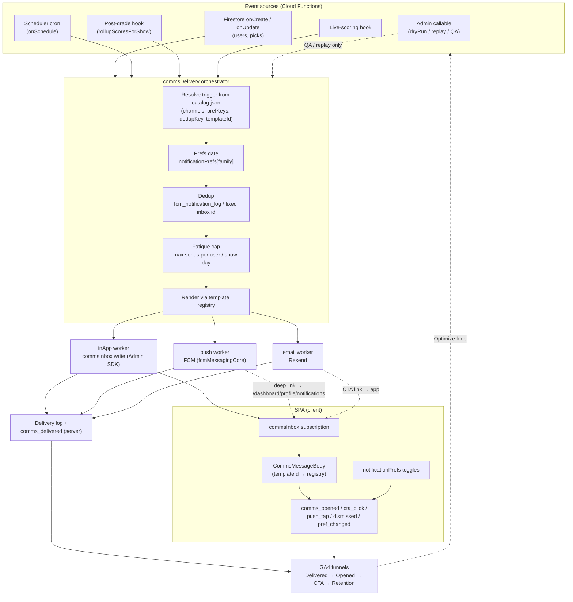

# Comms ecosystem — flow diagram & process descriptions

This document is the single visual + narrative reference for how a triggered
communication travels from a product **event** to a **delivered, measured**
message across in‑app, push, and email — fully automated, with **no manual
"War Room" send step** on the production path.

It complements the other comms docs:

- [`FRAMEWORK.md`](./FRAMEWORK.md) — the TTDMOM operating model (Trigger → Template → Deliver → Measure → Optimize → Monetize)
- [`catalog.json`](./catalog.json) / [`TRIGGER_CATALOG.md`](./TRIGGER_CATALOG.md) — the machine + human trigger registry
- [`MEASUREMENT_PLAN.md`](./MEASUREMENT_PLAN.md) — the GA4 events & funnels

---

## 1. End‑to‑end flow



**Reading the diagram:** every trigger contributes only a thin *resolver*
(audience + payload + dedup scope) and declares its `channels` / `prefKeys` in
`catalog.json`. The orchestrator owns the uniform path
(**prefs → dedup → fatigue → render → dispatch → log**). Channel workers are
**idempotent and pluggable** — adding email did not change push or in‑app.

---

## 2. The six layers (TTDMOM) and who owns them

Each layer maps 1:1 to a Cursor comms skill, so develop → curate → deploy is
repeatable rather than bespoke. The skills enforce the guardrails on every
change regardless of which agent (or human) makes it.

| Layer | Skill | Owns | Artifacts |
|-------|-------|------|-----------|
| **Trigger** | `comms-triggers` | *What fires* | `catalog.json`, `TRIGGER_CATALOG.md` |
| **Template** | `comms-drafter` | *What it says* | `content/comms/`, feature `model/` builders, `registry.js`, in‑app template registry |
| **Deliver** | `comms-architect` | *How it ships* | `functions/commsDelivery.js`, channel workers, `firestore.rules` |
| **Measure** | `comms-analyst` | *Did it work* | GA4 events + funnels, `MEASUREMENT_PLAN.md` |
| **Optimize** | `comms-analyst` + `comms-triggers` | *Make it better* | `EXPERIMENT_PLAYBOOK.md`, catalog updates |
| **Monetize** | `comms-architect` | *Commercial slots* | `COMMERCIAL_PHASE3.md` (gated) |

---

## 3. Process descriptions

### 3.1 Develop a new trigger (curation → code)

1. **Spec it** (`comms-triggers`): add a row to `catalog.json` **and**
   `TRIGGER_CATALOG.md` in the same commit — `triggerId`, `family`, `priority`,
   `automation`, `channels`, `prefKeys`, `dedupKey`, `templateId`, `variables`.
   File a `[SKIP-PRD]` GitHub issue under epic #272.
2. **Draft the copy** (`comms-drafter`): editorial draft in `content/comms/`,
   runtime copy in the in‑app template registry
   (`src/features/notifications/ui/commsTemplates/commsTemplateRegistry.jsx`)
   and/or feature `model/` builders, plus channel variants (push tease → inbox
   depth → email subject/body). Register the template.
3. **Wire delivery** (`comms-architect`): add a thin event adapter that calls
   the shared orchestrator with the trigger's resolver (audience + payload +
   dedup scope). No new prefs/dedup/log code — the orchestrator owns that.
4. **Instrument** (`comms-analyst`): the orchestrator already logs
   `comms_delivered`; confirm the client logs `comms_opened` / `comms_cta_click`
   for the new `templateId` (handled generically by the inbox renderer).

### 3.2 Curate / preview templates (no real data needed)

- Run the SPA in dev and open **`/comms-preview`** — a gallery that renders every
  registered in‑app template with realistic sample payloads. This is the
  development/QA "War Room" preview. It is **dev‑build only** (redirects home in
  production).
- For push/email previews, use the **Resend MCP** (drafting/QA only) and the
  push canary callable. The Resend MCP is **not** the production send path.

### 3.3 Deploy & roll out (automated, no manual send)

1. **Dry run** — orchestrator + new adapter run with `dryRun: true` (counts +
   payload preview, no writes/sends).
2. **Canary** — execute for a single test uid (`QA_TEST_EMAIL`), verify inbox +
   push + email land and `comms_delivered` is logged.
3. **Enable the adapter** — deploy the Cloud Function; the event source now fans
   out automatically. There is no human execute step.
4. **Monitor** — `fcm_notification_log`, CF error logs, and the GA4
   Delivered→Opened→CTA funnel.

### 3.4 Optimize (feedback loop)

`comms-analyst` report → `comms-triggers` updates catalog → `comms-drafter`
revises copy (new semver) → `comms-architect` adjusts channel mix / runs an A/B
→ `comms-analyst` measures. Variant assignment is a stable
`hash(uid + experimentId) % 100` bucket; every event already carries
`comms_variant` (default `control`) so experiments are drop‑in.

---

## 4. Channels

| Channel | Worker | Storage / transport | Notes |
|---------|--------|---------------------|-------|
| `inApp` | inbox worker | `users/{uid}/commsInbox/{messageId}` (Admin SDK) | Rich personalized body; clients read + set `readAt` only |
| `push` | push worker | FCM over `users/{uid}/private_fcmTokens` + `fcm_notification_log` | Short teaser + deep link to `/dashboard/profile/notifications` |
| `email` | email worker | **Resend** (`resend.batch.send`, idempotency key) | Verified `setlistpickem.com` sender; `List-Unsubscribe` (RFC 8058) wired to `notificationPrefs`; bounce/complaint webhook → suppress |

**Proven v1 pattern:** push tease → full message in inbox; email carries the
abbreviated teaser + CTA back into the app.

---

## 5. Preferences (gating)

`notificationPrefs` keys map 1:1 to catalog `prefKeys`. Resolved by
`src/features/notifications/api/notificationPrefsApi.js`:

| Key | Default | Gates |
|-----|---------|-------|
| `reminders` | on | picks lock reminder |
| `results` | on | show recap, score updates, rankings |
| `nearMiss` | on | close-call nudges |
| `lifecycle` | on | welcome, tour countdown, picks confirmed, tour engagement |
| `commercial` | **off (opt‑in)** | Phase 3 sponsor / affiliate slots |

Allow‑categories opt out only on an explicit `false`; `commercial` opts in only
on an explicit `true`. The orchestrator checks the trigger's `prefKeys` before
any send.

---

## 6. Measurement

Server logs `comms_delivered` (with `comms_trigger_id`, `comms_template_id`,
`comms_channel`, `comms_variant: control`). The client logs the engagement half
via `src/features/comms/model/commsAnalytics.js`:

`comms_opened` · `comms_dismissed` · `comms_cta_click` · `comms_push_tap` ·
`comms_pref_changed`.

Together they complete the funnel:

```text
Eligible → Delivered → Opened/Tapped → CTA → Retention action
```

See [`MEASUREMENT_PLAN.md`](./MEASUREMENT_PLAN.md) for the custom dimensions to
register in GA4.
