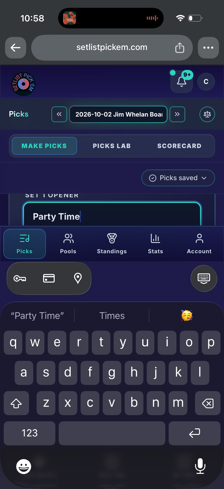
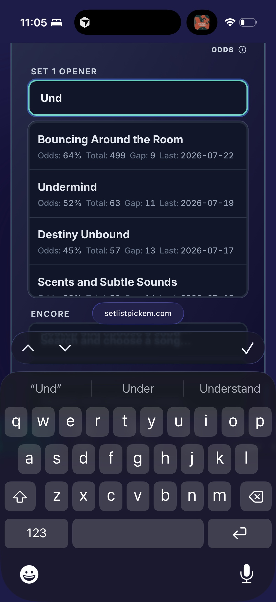

# Investigation: Make Picks crushed under keyboard (Chrome mobile)

**Status:** draft investigation — options only; no code ship yet  
**Date:** 2026-09-23 (updated same day with Safari contrast)  
**Tracking:** GitHub issue **#1041**  
**Reporter context:** Same Make Picks flow on iPhone — **Chrome** (broken) vs **Safari** (usable)  
**Related IA:** Picks tertiary (#766), tertiary chrome contract (#765), mobile fixed chrome (#609)  

### Evidence (in-repo)

| Browser | Result | File |
|---------|--------|------|
| **Chrome iOS** | Letterboxed field; bottom nav above keyboard; catalog suggestions not usable | [`evidence/chrome-ios-keyboard-crushed.jpg`](evidence/chrome-ios-keyboard-crushed.jpg) |
| **Safari iOS** | Field + ≥4 suggestion rows readable; app bottom nav not in the typing band; easier to navigate | [`evidence/safari-ios-keyboard-usable.jpg`](evidence/safari-ios-keyboard-usable.jpg) |

---

## Verdict

**Chrome iOS is the failure mode; Safari iOS on the same device/app remains navigable.** Same Make Picks form, same tertiary chrome, same `SongAutocomplete` — so this is not “tertiary alone always breaks picking.” It is **Chrome’s keyboard + browser-chrome interaction with our fixed shell** (tall top stack + `position: fixed` bottom nav) that sandwiches the field.

Tertiary height (#766) still matters as a **Chrome aggravator**: it removes margin when Chrome keeps our chrome in the visual viewport. Safari’s keyboard presentation effectively gives the focused field + suggestion list the usable band, so the same chrome budget is tolerable there.

---

## Side-by-side: Chrome vs Safari (reporter evidence)

### Chrome iOS — crushed



Vertical stack when typing a pick:

1. iOS status / Dynamic Island  
2. **Chrome address bar** (taller “new Chrome” mobile UI — stays in play)  
3. App brand bar (logo + bell + avatar)  
4. Context bar (“Picks” + show date stepper + Scale)  
5. Tertiary tray (MAKE PICKS / PICKS LAB / SCORECARD)  
6. Tools band (“Picks saved” pill)  
7. **Tiny content strip** — truncated label + focused input  
8. **Primary bottom nav** (Picks / Pools / Standings / Stats / Account) — *above* the keyboard  
9. iOS password/autofill toolbar  
10. Keyboard + system suggestion strip  

Catalog autocomplete has nowhere to open under the field.

### Safari iOS — usable (contrast)



Observed when typing `Und` on Set 1 Opener:

1. iOS status / Dynamic Island only at the top (no app brand/tertiary stack dominating the typing band)  
2. Focused **SET 1 OPENER** field with room around it  
3. **Four catalog suggestion rows** visible (e.g. Bouncing Around the Room, Undermind, Destiny Unbound, Scents and Subtle Sounds) with Odds / Total / Gap / Last  
4. More form content (e.g. ENCORE) still peeking in the scrollport above the browser chrome  
5. Safari floating URL pill + form accessory (prev/next/done) stacked above the keyboard — **not** our primary bottom nav  
6. iOS predictive strip (`Und` / Under / Understand) fully visible  

**Navigation difference:** In Safari the picks form stays the job of the visual viewport; browser chrome hugs the keyboard. In Chrome our **primary bottom nav reappears above the keyboard** and the fixed top stack remains, so the form is letterboxed and harder to scan/select.

### Comparison table

| Dimension | Chrome iOS | Safari iOS |
|-----------|------------|------------|
| Focused pick field | Severely compressed | Comfortable, full control chrome |
| `SongAutocomplete` list | Not usable / no room | ≥4 rows readable |
| App bottom nav while typing | Visible **above** keyboard | Not occupying the typing band |
| App top chrome (brand / tertiary / status) | Stays stacked in view | Not dominating the typing band |
| Browser chrome | Tall Chrome address bar + autofill bar | Compact Safari URL pill + accessory |
| Overall navigate-while-typing | Poor | Acceptable / easy |

---

## Root cause (layered)

### 1) Make Picks mobile chrome is very tall (tertiary aggravator)

`DashboardLayout` reserves **`15.25rem` (~244px) + safe-area** top padding for the Picks cluster:

```329:336:src/app/layout/DashboardLayout.jsx
          usesMobileFixedChrome
            ? // Picks: tertiary + optional Make Picks tools. Stats Personal/Global:
              // tertiary + up to two quaternary inset trays.
              isPicksCluster
              ? 'pt-[calc(env(safe-area-inset-top,0px)+15.25rem)]'
              : isStatsQuaternary
                ? 'pt-[calc(env(safe-area-inset-top,0px)+17.75rem)]'
                : 'pt-[calc(env(safe-area-inset-top,0px)+11.75rem)]'
```

That budget maps to fixed bands:

| Band | Source | Approx height |
|------|--------|---------------|
| Brand | `DashboardMobileBrandBar` | ~3–3.5rem |
| Context (title + date) | `DashboardMobileContextBar` `min-h-[3.375rem]` | ~3.4rem |
| Tertiary tray | `PicksClusterMobileChrome` via `DashboardMobileChromeBar` `min-h-[3.5rem]` | ~3.5rem |
| Status tools | `PicksMobileFixedChrome` (when “Picks saved” / locked shows) | ~3.5rem |

Pre-#766 Make Picks had brand + context (+ optional tools) without the Lab/Scorecard tray. Adding the tertiary band is a durable **~56px** tax — painful when Chrome keeps that stack on-screen during keyboard, tolerable when Safari does not.

### 2) Bottom nav is `position: fixed; bottom: 0` — Chrome keeps it in the typing band

```491:492:src/app/layout/DashboardLayout.jsx
      <nav className="md:hidden fixed inset-x-0 bottom-0 z-50 w-full border-t ... pb-[env(safe-area-inset-bottom,0px)] ...">
        <div className={`grid ${isAdmin ? 'grid-cols-6' : 'grid-cols-5'} ... h-16`}>
```

Both browsers are WebKit-based on iOS, but **reporter evidence diverges**:

- **Chrome:** fixed primary nav sits **above** the keyboard and competes with the field.  
- **Safari:** that nav is **not** in the typing band; Safari’s own URL/accessory chrome sits on the keyboard stack instead.

So “fixed bottom always rides the layout-viewport offset on every WebKit browser” is too strong. Chrome’s combination of address-bar UI + viewport/offset behavior is what surfaces our footer during entry. We still opted into the worst case by **always showing** primary nav during text entry with no keyboard-aware hide.

There is **no** existing `visualViewport` / keyboard-open hook in the dashboard shell today.

### 3) Shell is a locked `100dvh` frame

```208:208:src/app/layout/DashboardLayout.jsx
    <div className="flex h-[100dvh] min-h-0 w-full ... overflow-hidden md:h-screen">
```

The scrollport is only `<main>`. When Chrome keeps header + footer in the visual viewport, there is almost no flex space for the focused field and zero spare room for an absolute dropdown. Safari’s presentation leaves that scrollport usable (field + list + peek of next sections).

### 4) Autocomplete cannot escape a Chrome squeeze

```209:213:src/shared/ui/SongAutocomplete.jsx
      {isOpen && filteredSongs.length > 0 && (
        <ul
          role="listbox"
          className="absolute z-50 mt-2 max-h-64 w-full overflow-y-auto ..."
        >
```

Same `z-50` as bottom nav; opens downward only; not portaled. Under Chrome’s keyboard + bottom nav this list is clipped / covered. **Safari proves the component itself is fine** when vertical room exists — four rows render with full stats.

### 5) Chrome mobile UI shrinks the visual budget further

Reporter’s “new Google Chrome format” matches a taller address bar / browser chrome on iOS Chrome vs Safari’s compact floating URL pill. Environmental, not Tailwind — but it lowers the threshold where our fixed stack becomes unusable **in Chrome only**.

### Viewport meta note (Android vs iOS)

`app.html` / `index.html` use:

`width=device-width, initial-scale=1.0, viewport-fit=cover`

No `interactive-widget=…`. On **Chrome Android**, default since 108 is roughly `resizes-visual`. On **iOS Chrome/Safari**, `interactive-widget` is **not implemented** (WebKit). A meta-only fix will not equalize Chrome with Safari on iPhone; it may still be useful as a defensive Android opt-in later.

---

## Rough height math (Chrome failure)

Illustrative iPhone ~852 CSS px tall **when Chrome keeps our chrome visible**:

- Browser chrome + keyboard + system bars: often **~45–55%** of the screen when typing  
- Our fixed app chrome (top 15.25rem + bottom `h-16`): **~308px** before safe-area  
- Remainder for the pick field + suggestions: often **&lt; 100px** → matches the Chrome letterbox  

Safari avoids that failure by not presenting the same app chrome sandwich in the typing band — so the same `15.25rem` pad is not the binding constraint there.

---

## Research & platform model (Chrome vs Safari)

Authoritative mobile-web guidance treats **layout viewport** vs **visual viewport** as the core split when an on-screen keyboard (OSK) appears. Our shell (`position: fixed` header/footer + `100dvh` + nested scrollport) is exactly the class of UI Chrome’s guidance flags for OSK testing.

### What the platform docs say

| Source | Claim relevant to us |
|--------|----------------------|
| [Chrome Developers — viewport resize behavior (Chrome 108+)](https://developer.chrome.com/blog/viewport-resize-behavior) | Pre-108 Android resized **layout + visual**; Chrome 108 aligned Android with **iOS Safari / iOS Chrome**: by default resize **visual only** (`resizes-visual`). `position: fixed` stays layout-anchored and **can be obscured by the OSK**. Authors must watch fixed elements + viewport units. |
| Same — `interactive-widget` | Opt-in on Chromium: `resizes-visual` (default), `resizes-content` (old Android — layout shrinks; fixed footers move), `overlays-content` (neither resizes). **Not a portable iOS fix.** |
| [CSS Viewport draft — `interactive-widget`](https://drafts.csswg.org/css-viewport-1/#interactive-widget-section) | Spec surface for the meta key; behavior is engine-defined. |
| [WebKit #259770](https://bugs.webkit.org/show_bug.cgi?id=259770) | WebKit still **does not implement** `interactive-widget`; iOS Safari/Chrome cannot opt into layout resize via meta. Authors who need “composer above keyboard” on iOS must use **script** (`visualViewport`) or accept overlay. Open as of 2026 comments. |
| [MDN — `VisualViewport`](https://developer.mozilla.org/en-US/docs/Web/API/VisualViewport) | OSK can shrink the **visual** viewport without changing the **layout** viewport. Official pattern for “device-fixed” simulation listens to `resize` **and** `scroll` on `visualViewport` (pinch-zoom and keyboard pans both move the visual rect). |
| [Bramus explainer — viewport resize behavior](https://github.com/bramus/viewport-resize-behavior/blob/main/explainer.md) | Interop taxonomy: Group 1 (iOS Safari/Chrome — visual-only) vs Group 2 (legacy Android layout resize). Overlay mode needs manual insets (`keyboard-inset-*` / VirtualKeyboard API) — Chromium-leaning, not Safari. |
| [CSSWG #7475](https://github.com/w3c/csswg-drafts/issues/7475) | Ongoing debate: should `position: fixed` avoid the keyboard by default? No shipped interop; apps must not wait on a CSS-only fix. |
| Production pattern (e.g. keyboard overlap = `clientHeight − vv.height − vv.offsetTop`) | Industry practice for iOS: measure **layout/visual overlap including pan** (`offsetTop`), use `documentElement.clientHeight` (not naive `innerHeight`), recompute on `visualViewport` resize **and** scroll. On Chromium with `resizes-content`, overlap often ~0 (footer already clears). |

### How that maps to our reporter evidence

Chrome’s blog expected “sites that work on Safari iOS should work on Chrome Android after 108.” Our evidence shows the **inverse pain on iOS Chrome vs iOS Safari** for a **dense fixed-chrome app shell**: same WebKit family, different browser chrome + visual-viewport presentation, so the same fixed primary nav is **in the typing band on Chrome** and **out of the way on Safari**. That is consistent with Group‑1 “fixed can be obscured / offset oddly” side-effects — not with a Safari-only bug in our React tree.

**Implication for options:** Prefer **scripted visual-viewport policy** (hide or inset chrome) over meta-only levers for the iPhone Chrome report. Treat Android `interactive-widget` as a **secondary** interop knob after iOS Chrome matches Safari’s usable band.

### Fit to Setlist Pick’em design principles

| Principle | Where documented | Implication for keyboard UX |
|-----------|------------------|-----------------------------|
| **Mobile fixed chrome under context bar** | `docs/DASHBOARD_IA.md` tertiary contract — portal bands stay visible while body scrolls | Chrome keeps those bands + bottom nav in the OSK visual band → violates the *intent* of “body scrolls under chrome” by leaving **no body**. Keyboard-scoped collapse preserves the contract when not typing. |
| **One job per dense viewport** | Product/UI guidance (Make Picks = lock songs) | While focused, the job is **catalog entry**, not primary-tab switching. Hiding bottom nav (A) / collapsing tertiary (B) aligns with one-job focus; permanent IA removal (E) is heavier. |
| **Primary tab stays active; tertiary equal-width tray** | `DASHBOARD_IA.md` #765/#766 | Do **not** delete Lab/Scorecard routes to fix Chrome. Prefer temporary hide over forking tray CSS or dropping segments. |
| **Safe-area + glass chrome** | `DashboardLayout` `env(safe-area-inset-*)`, design system glass surfaces | Any hide/inset must restore safe-area padding on blur; avoid double-counting keyboard + home indicator. |
| **Reduced FSD** | `.cursorrules` | Keyboard detection → `shared/hooks`; shell reaction → `DashboardLayout`; picks-only entry mode → `features/picks/model`; autocomplete portal → `shared/ui/SongAutocomplete`. |
| **Safari as acceptance baseline** | This investigation’s evidence | “Works on Safari” is **necessary but not sufficient** for Chrome iOS. QA matrix must include **both** (Chrome blog’s Android↔Safari assumption does not cover our Chrome-iOS failure). |

### Mobile web best-practice summary (applied)

1. **Assume two viewports** — never treat `100dvh` + `position: fixed; bottom: 0` as “always above the keyboard” or “always behind it.”  
2. **Use `visualViewport` for OSK-aware chrome** — gate on height delta + ignore pinch-zoom (`scale !== 1`); listen to resize **and** scroll.  
3. **Do not rely on `interactive-widget` for iOS** — Chromium-only; WebKit unimplemented.  
4. **Prefer ephemeral chrome changes while typing** over permanent IA cuts when Safari already proves the IA is fine.  
5. **Floating overlays (autocomplete) must size to the visual viewport**, not assume layout-bottom space exists under the caret.

---

## Options (research-informed benefits / risks)

### Option A — Hide primary bottom nav while keyboard is open (fast, high leverage)

**Idea:** Detect keyboard via `window.visualViewport` (overlap / height drop vs layout `clientHeight`, ignore pinch-zoom). When open, hide/translate the mobile bottom `<nav>` and shrink `<main>` bottom padding — matching Safari’s “nav not in typing band” outcome without UA sniffing.

| | |
|--|--|
| **Benefits** | Directly targets Chrome evidence; aligns with MDN/OSK practice and “one job while typing”; ~64px+ reclaim; small blast radius (`DashboardLayout` + shared hook); should be mild/no-op on Safari if gated on real overlap. |
| **Risks** | URL-bar collapse can look like a small “keyboard” — need threshold (often ≥100–150px) and optional `scale === 1` guard; restore failures leave nav missing; a11y: ensure focus isn’t trapped with no alternate egress (blur still works). |
| **Principle fit** | Strong — ephemeral; keeps tertiary IA and primary-tab contract intact. |
| **Research fit** | Implements the portable Group‑1 mitigation Chrome/MDN describe (script against visual viewport) instead of waiting on WebKit `interactive-widget`. |

### Option B — Picks “entry focus mode” (best Chrome↔Safari comfort)

**Idea:** While any Make Picks `SongAutocomplete` is focused: do A, plus collapse tertiary + status tools (optional slim Done / show label); scroll active field into the visual viewport.

| | |
|--|--|
| **Benefits** | Largest Chrome readability win when top stack stays; mirrors Safari’s content-first band; matches “one job” for locking picks. |
| **Risks** | Product/IA care: users lose one-tap Lab/Scorecard/status while typing (acceptable if restored on blur); more orchestration (focus/blur races with autocomplete mousedown); must not break lock messaging after blur. |
| **Principle fit** | Strong if **temporary** — does not rewrite #766 tray contract permanently. Weaker if we permanently remove trays (that becomes E). |
| **Research fit** | Same visualViewport foundation as A; closer to chat/composer “editing chrome” patterns that WebKit bugs describe as needing layout resize (which iOS won’t give us). |

### Option C — Portal / flip autocomplete (defense in depth)

**Idea:** Portal the listbox; position from `getBoundingClientRect()` / visualViewport; flip upward when space below is insufficient; cap `max-height` to remaining visual space.

| | |
|--|--|
| **Benefits** | Hardens Chrome squeeze; Safari already works but gains resilience on short phones / landscape; reusable for admin builders; does not fight browser chrome. |
| **Risks** | Focus/blur + scroll listeners can flicker; z-index vs fixed chrome; alone **does not** free the crushed input chrome (A/B still needed for field readability). |
| **Principle fit** | Strong for shared UI kit; no IA change. |
| **Research fit** | Classic “size overlays to visual viewport” practice from MDN’s dual-viewport model. |

### Option D — CSS / viewport meta only (insufficient for iOS Chrome)

| Lever | Effect | Benefit | Risk |
|-------|--------|---------|------|
| `interactive-widget=overlays-content` | Android: no viewport resize | Predictable overlay + manual insets | iOS ignore; may worsen “content under keyboard” if we don’t inset |
| `interactive-widget=resizes-content` | Android: layout shrinks (pre-108) | Footer may clear keyboard on Android | Fixed chrome **jumps**; `dvh` churn; **does not help iOS**; can recreate sandwich on Android |
| Shell `100svh` vs `100dvh` | Stable large/small viewport units | Less URL-bar jitter | Does not hide Chrome’s lifted bottom nav on iOS |
| VirtualKeyboard API / `env(keyboard-inset-*)` | Chromium overlaysContent insets | Clean CSS insets where supported | Not Safari/iOS Chrome |

| | |
|--|--|
| **Benefits** | Cheap to try on Android; documents intent. |
| **Risks** | **False confidence** — Chrome blog’s Safari parity claim fails our iOS Chrome case; WebKit #259770 means meta cannot equalize. |
| **Principle fit** | Weak as sole fix; OK as Android follow-up after A/C. |
| **Recommendation** | Do **not** ship D alone for #1041. |

### Option E — Permanent chrome declutter on Make Picks (IA tweak)

**Idea:** Always-on height cuts (slim status out of full `DashboardMobileChromeBar`, tighter mins, or controversial overflow for Lab/Scorecard).

| | |
|--|--|
| **Benefits** | Helps Chrome even before focus; reduces pad constants (`15.25rem`). |
| **Risks** | Touches `DASHBOARD_IA.md` tertiary contract; Safari evidence shows **permanent** declutter is unnecessary for a usable Safari path; easy to over-fit Chrome browser chrome that may change again. |
| **Principle fit** | Weakest of the ephemeral options — prefer A/B keyboard-scoped changes that preserve equal-width tertiary trays when not typing. |
| **Research fit** | Treats a **viewport interop** problem as an **IA** problem; platforms are still converging (CSSWG #7475). |

---

## Recommended plan

1. **Ship A + C together** as the first fix PR — primary goal: **Chrome iOS matches Safari’s usable typing band** (no bottom nav over the field; ≥3–4 suggestion rows). Grounded in visualViewport best practice + reporter Safari baseline. Re-verify Safari does not regress.  
2. **Follow with B** if Chrome still keeps brand/tertiary/status stacked and the field feels cramped after A (likely on small phones / tall Chrome address bars).  
3. Keep **E** as optional polish only after measuring post-A/C — do not lead with IA cuts.  
4. Skip relying on **D** for iPhone Chrome; re-evaluate Android `interactive-widget` only if QA diverges after A/C.

### Suggested acceptance checks

- **iPhone Chrome:** focus Set 1 Opener → field readable and **at least 3–4 suggestion rows** visible (Safari baseline); bottom nav not covering suggestions.  
- **iPhone Safari:** no regression vs current usable behavior (field + suggestions + predictive strip).  
- Android Chrome: same smoke; footer restores cleanly on blur.  
- Blur / navigate away: bottom nav and tertiary restore; no stuck `translate` or padding.  
- Landscape / Dynamic Island / home-indicator safe-area: no double padding.

### Implementation sketch (not committed)

- `shared/hooks/useVirtualKeyboardOpen.js` — visualViewport listener → boolean + optional `keyboardInsetPx` CSS var on `documentElement`.  
- `DashboardLayout` — apply `data-keyboard-open` to hide mobile bottom nav + adjust `main` `pb-*`.  
- `SongAutocomplete` — portal listbox; flip when `spaceBelow < minMenu`.  
- Optional picks focus mode: `features/picks/model` sets `data-picks-entry-focus` to collapse portal chrome roots.

---

## Out of scope / non-goals

- Redesigning desktop sticky chrome  
- Changing Picks tertiary routes or labels  
- Expecting WebKit `interactive-widget` to equalize Chrome and Safari  

---

## Decision needed

Product/engineering pick among **A+C (recommended first PR)**, **A+B+C (max Chrome↔Safari parity)**, or **E-first IA change**.

Research bias: **ephemeral visualViewport policy (A/B) + visual-viewport-sized overlays (C)** over meta-only (D) or permanent IA cuts (E), because WebKit lacks `interactive-widget` and Safari already validates our tertiary IA when the typing band is free.

This document is the options brief; implementation should land in a separate `feat/<issue#>-…` PR against `staging` with PATCH/MINOR SemVer once behavior ships.
